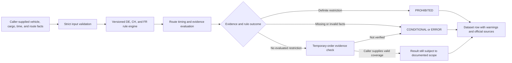

> **Live API:** [Run Europe Truck Dispatch Guard on Apify](https://apify.com/kamerozkan/europe-truck-dispatch-guard)

# Europe Truck Ban Checker - Route & Holiday Rules: Samples

Route-aware 2026 truck-ban decisions for Germany, Switzerland, France, and cross-border journeys, with official sources and safer departure times.

[Run Europe Truck Ban Checker - Route & Holiday Rules on Apify](https://apify.com/kamerozkan/europe-truck-dispatch-guard)

[](https://apify.com/kamerozkan/europe-truck-dispatch-guard)


Turn caller-supplied vehicle, cargo, departure, and route facts into source-linked 2026 truck-restriction decision support for Germany, Switzerland, France, and supported cross-border journeys.

This repository contains three input examples, three privacy-minimized real output projections, and the sample row contract in [`dataset_record.schema.json`](dataset_record.schema.json).

> **Important:** This Actor provides automated decision support, not legal advice, a permit to drive, a route-safety guarantee, or a complete temporary-order check. A `CONDITIONAL` result requires human or maintained-feed verification of the listed gaps.

## Start here

1. Open the [Actor on Apify](https://apify.com/kamerozkan/europe-truck-dispatch-guard).
2. Copy an input below and replace the historical 2026 date, route, vehicle, and cargo facts.
3. Start with one query and set a maximum run charge in Apify.
4. Read `warnings`, `manualReviewRequired`, `temporaryOrderAssessment`, and every cited official source before operational use.

At the 2026-07-28 audit, the Actor was public and build `0.6.7` had completed successfully. The owner console showed zero Saved tasks, and the Store exposed zero public Examples. Inputs 02 and 03 are exact historical successful-run configurations, not public Apify Example Tasks. The inspected run evidence is from builds `0.6.3` and `0.6.4`; build `0.6.7` had no inspected run evidence. See [`DATA_NOTICE.md`](DATA_NOTICE.md) for IDs and the full provenance boundary.

## Why the evidence model matters

| Concern | Calendar-only check | This sample contract |
|---|---|---|
| Missing temporary-order evidence | May be hidden from the result | Preserves `NOT_VERIFIED`, warnings, and manual review |
| Cross-border journey | Often checked only at departure | Can return one `AUTO` result with detected supported countries |
| Source trail | Free-text conclusion | Restriction code, interval, source URL, section, and access date |
| Incomplete route facts | Can be treated as a negative | Uses `CONDITIONAL` or `ERROR` instead of filling gaps |
| Version boundary | Rules may be silently reused | Publishes the rule-set version and validity period |

The comparison describes the shown output contract. It does not promise legal completeness, accuracy, coverage, or route safety.

## Input examples

<details>
<summary><strong>01. Current build default</strong> - cross-border AUTO query from the 0.6.7 input schema</summary>

[`01_cross_border_public_schema_input.json`](01_cross_border_public_schema_input.json)

```json
{
  "queries": [
    {
      "queryId": "freiburg-geneva-lyon-auto",
      "country": "AUTO",
      "departureTime": "2026-07-13T21:00:00+02:00",
      "vehicle": {
        "isTruck": true,
        "maximumPermissibleWeightTonnes": 18,
        "hasTrailer": false,
        "franceVehicleCategory": "STANDARD_GOODS"
      },
      "transport": {
        "isCommercialOrPaidGoodsTransport": true,
        "isGoodsTransport": true,
        "cargoCategory": "GENERAL",
        "swissExemptionCategory": "NONE",
        "franceExemptionCategory": "NONE"
      },
      "route": {
        "geometry": {
          "type": "LineString",
          "coordinates": [
            [
              7.85,
              47.99
            ],
            [
              7.59,
              47.56
            ],
            [
              6.14,
              46.2
            ],
            [
              4.84,
              45.76
            ]
          ]
        },
        "segmentDurationsMinutes": [
          30,
          180,
          120
        ]
      },
      "includeNextLegalDeparture": true
    }
  ]
}
```

This is the exact default object exposed by successful build `0.6.7`. It is a current-schema example, not a public task or an inspected `0.6.7` run.

</details>

<details>
<summary><strong>02. Verified cross-border conditional run</strong> - exact input from build 0.6.4</summary>

[`02_cross_border_conditional_replay_input.json`](02_cross_border_conditional_replay_input.json)

```json
{
  "queries": [
    {
      "queryId": "freiburg-geneva-lyon-tuesday-morning",
      "country": "AUTO",
      "departureTime": "2026-07-28T10:00:00+02:00",
      "vehicle": {
        "isTruck": true,
        "maximumPermissibleWeightTonnes": 18,
        "hasTrailer": false,
        "franceVehicleCategory": "STANDARD_GOODS"
      },
      "transport": {
        "isCommercialOrPaidGoodsTransport": true,
        "isGoodsTransport": true,
        "cargoCategory": "GENERAL",
        "swissExemptionCategory": "NONE",
        "franceExemptionCategory": "NONE"
      },
      "route": {
        "geometry": {
          "type": "LineString",
          "coordinates": [
            [
              7.85,
              47.99
            ],
            [
              7.59,
              47.56
            ],
            [
              6.14,
              46.2
            ],
            [
              4.84,
              45.76
            ]
          ]
        },
        "segmentDurationsMinutes": [
          30,
          180,
          120
        ]
      },
      "includeNextLegalDeparture": true
    }
  ]
}
```

This historical input produced output 02. Its lack of complete road-span and temporary-order evidence is visible in the result instead of being hidden.

</details>

<details>
<summary><strong>03. Verified Germany batch</strong> - exact two-query input from build 0.6.3</summary>

[`03_verified_germany_batch_input.json`](03_verified_germany_batch_input.json)

```json
{
  "queries": [
    {
      "queryId": "sunday-general-cargo",
      "country": "DE",
      "departureTime": "2026-07-12T10:00:00+02:00",
      "routeStates": [
        "DE-BY",
        "DE-BW"
      ],
      "routeRoads": [
        "A8"
      ],
      "vehicle": {
        "isTruck": true,
        "maximumPermissibleWeightTonnes": 18,
        "hasTrailer": true
      },
      "transport": {
        "isCommercialOrPaidGoodsTransport": true,
        "cargoCategory": "GENERAL"
      },
      "includeNextLegalDeparture": true
    },
    {
      "queryId": "summer-a8-segment",
      "country": "DE",
      "departureTime": "2026-07-11T10:00:00+02:00",
      "routeStates": [
        "DE-BY",
        "DE-BW"
      ],
      "routeRoads": [
        "A8"
      ],
      "routeIncludesRestrictedSummerSegment": true,
      "vehicle": {
        "isTruck": true,
        "maximumPermissibleWeightTonnes": 18,
        "hasTrailer": true
      },
      "transport": {
        "isCommercialOrPaidGoodsTransport": true,
        "cargoCategory": "GENERAL"
      },
      "includeNextLegalDeparture": true
    }
  ]
}
```

This is a legacy departure-only configuration. `routeIncludesRestrictedSummerSegment: true` is a caller assertion and must only be used after the route has been checked against the listed road segment.

</details>

## Live output examples

The files below are historical evidence of the output contract. They are not current permission to dispatch. Fields that the public Store README displayed only as shortened placeholders were omitted instead of being inferred.

<details>
<summary><strong>01. Cross-border prohibited result</strong> - Swiss night window plus French holiday window</summary>

[`01_live_cross_border_prohibited_output.json`](01_live_cross_border_prohibited_output.json)

```json
{
  "queryId": "freiburg-geneva-lyon-auto",
  "country": "AUTO",
  "decision": "PROHIBITED",
  "departureTime": "2026-07-13T21:00:00+02:00",
  "nextLegalDeparture": null,
  "subjectToTruckBanRules": true,
  "routeStates": [
    "DE-BW"
  ],
  "restrictions": [
    {
      "code": "CH_VRV_91_NIGHT_BAN",
      "title": "Swiss heavy-vehicle night driving ban",
      "certainty": "DEFINITE",
      "startsAt": "2026-07-13T22:00:00+02:00",
      "endsAt": "2026-07-14T05:00:00+02:00",
      "affectedStates": [],
      "affectedRoads": [],
      "explanation": "The Swiss heavy-vehicle night driving ban applies from 22:00 to 05:00.",
      "source": {
        "title": "Federal Roads Office (ASTRA) - Sunday and night journeys",
        "url": "https://www.astra.admin.ch/de/sonntags-und-nachtfahrten",
        "section": "General 22:00-05:00 night ban and Sunday ban",
        "accessedOn": "2026-07-26"
      }
    },
    {
      "code": "FR_ART1_HOLIDAY_NATIONAL_DAY",
      "title": "French National Day French goods-vehicle driving ban",
      "certainty": "DEFINITE",
      "startsAt": "2026-07-14T00:00:00+02:00",
      "endsAt": "2026-07-14T22:00:00+02:00",
      "affectedStates": [],
      "affectedRoads": [],
      "explanation": "French National Day is a national French public holiday; the nationwide restriction applies from 00:00 to 22:00.",
      "source": {
        "title": "French order of 16 April 2021 on goods-vehicle driving restrictions",
        "url": "https://www.legifrance.gouv.fr/loda/id/JORFTEXT000043416004/",
        "section": "Articles 1-5 and Annexes I-III",
        "accessedOn": "2026-07-26"
      }
    }
  ],
  "exemptionsApplied": [],
  "warnings": [
    "[DE] State crossings use generalized NUTS 2024 boundaries and may differ slightly near borders.",
    "[DE] route.roadSpansComplete is not true. Summer-road coverage may require manual review.",
    "[CH] Swiss entry and exit points use a generalized GISCO 2024 country boundary and may differ slightly near borders.",
    "[FR] French country and regional entry/exit points use generalized GISCO 2024 boundaries and may differ slightly near borders.",
    "No temporary-order clearance covers the complete journey. A competent authority or maintained live-order feed must verify temporary bans and exemptions."
  ],
  "manualReviewRequired": true,
  "departureOptions": [],
  "ruleSetVersion": "DE-2026.07.26-v2.2 + CH-2026.07.26-v1.1 + FR-2026.07.26-v1.1",
  "evaluatedAt": "2026-07-28T13:47:48.897Z",
  "error": null,
  "ruleValidity": {
    "validFrom": "2026-01-01T00:00:00+01:00",
    "validThrough": "2026-12-31T23:59:59.999+01:00",
    "journeyCovered": true
  },
  "temporaryOrderAssessment": {
    "status": "NOT_VERIFIED",
    "clearanceCoversJourney": false,
    "checkedAt": null,
    "validFrom": null,
    "validThrough": null,
    "authority": null,
    "referenceUrl": null
  }
}
```

</details>

<details>
<summary><strong>02. Cross-border conditional result</strong> - no shown restriction, but important evidence gaps remain</summary>

[`02_live_cross_border_conditional_output.json`](02_live_cross_border_conditional_output.json)

```json
{
  "queryId": "freiburg-geneva-lyon-tuesday-morning",
  "country": "AUTO",
  "decision": "CONDITIONAL",
  "departureTime": "2026-07-28T10:00:00+02:00",
  "nextLegalDeparture": null,
  "subjectToTruckBanRules": true,
  "routeStates": [
    "DE-BW"
  ],
  "restrictions": [],
  "exemptionsApplied": [],
  "warnings": [
    "[DE] State crossings use generalized NUTS 2024 boundaries and may differ slightly near borders.",
    "[DE] route.roadSpansComplete is not true. Summer-road coverage may require manual review.",
    "[CH] Swiss entry and exit points use a generalized GISCO 2024 country boundary and may differ slightly near borders.",
    "[FR] French country and regional entry/exit points use generalized GISCO 2024 boundaries and may differ slightly near borders.",
    "No temporary-order clearance covers the complete journey. A competent authority or maintained live-order feed must verify temporary bans and exemptions."
  ],
  "manualReviewRequired": true,
  "routeAnalysis": {
    "distanceKm": 350.46,
    "durationMinutes": 330,
    "estimatedArrivalTime": "2026-07-28T15:30:00+02:00",
    "detectedCountries": [
      "DE",
      "CH",
      "FR"
    ]
  },
  "journeyConflicts": [],
  "departureOptions": [],
  "ruleSetVersion": "DE-2026.07.26-v2.2 + CH-2026.07.26-v1.1 + FR-2026.07.26-v1.1",
  "evaluatedAt": "2026-07-28T21:22:18.361Z",
  "error": null,
  "ruleValidity": {
    "validFrom": "2026-01-01T00:00:00+01:00",
    "validThrough": "2026-12-31T23:59:59.999+01:00",
    "journeyCovered": true
  },
  "temporaryOrderAssessment": {
    "status": "NOT_VERIFIED",
    "clearanceCoversJourney": false,
    "checkedAt": null,
    "validFrom": null,
    "validThrough": null,
    "authority": null,
    "referenceUrl": null
  }
}
```

No restriction in this projection does not mean permission to drive. The result remains `CONDITIONAL`, sets `manualReviewRequired: true`, and identifies missing temporary-order and route evidence.

</details>

<details>
<summary><strong>03. German summer A8 result</strong> - definite listed-segment restriction with source trail</summary>

[`03_live_summer_a8_prohibited_output.json`](03_live_summer_a8_prohibited_output.json)

```json
{
  "queryId": "summer-a8-segment",
  "country": "DE",
  "decision": "PROHIBITED",
  "departureTime": "2026-07-11T10:00:00+02:00",
  "nextLegalDeparture": null,
  "subjectToTruckBanRules": true,
  "routeStates": [
    "DE-BY",
    "DE-BW"
  ],
  "restrictions": [
    {
      "code": "DE_FERREISEV_SUMMER_SATURDAY",
      "title": "German summer Saturday truck driving ban",
      "certainty": "DEFINITE",
      "startsAt": "2026-07-11T07:00:00.000+02:00",
      "endsAt": "2026-07-11T20:00:00.000+02:00",
      "affectedStates": [
        "DE-BY",
        "DE-BW"
      ],
      "affectedRoads": [
        "A8"
      ],
      "explanation": "From 1 July through 31 August, qualifying goods vehicles are restricted on listed road segments on Saturdays from 07:00 to 20:00. Potentially matching statutory segments: Karlsruhe triangle to München-Obermenzing junction; München-Ramersdorf junction to Bad Reichenhall junction.",
      "source": {
        "title": "Federal Ministry of Transport - holiday-season truck driving ban",
        "url": "https://www.bmv.de/SharedDocs/DE/Artikel/StV/Strassenverkehr/lkw-fahrverbot-in-der-ferienreisezeit.html",
        "section": "Ferienreiseverordnung § 1; route list updated 2026-07-01",
        "accessedOn": "2026-07-26"
      }
    }
  ],
  "exemptionsApplied": [],
  "warnings": [
    "No temporary-order clearance covers the complete journey. A competent authority or maintained live-order feed must verify temporary bans and exemptions."
  ],
  "manualReviewRequired": true,
  "routeAnalysis": null,
  "journeyConflicts": [],
  "departureOptions": [],
  "ruleSetVersion": "DE-2026.07.26-v2.2",
  "evaluatedAt": "2026-07-26T17:59:21.709Z",
  "error": null,
  "ruleValidity": {
    "validFrom": "2026-01-01T00:00:00+01:00",
    "validThrough": "2026-12-31T23:59:59.999+01:00",
    "journeyCovered": true
  },
  "temporaryOrderAssessment": {
    "status": "NOT_VERIFIED",
    "clearanceCoversJourney": false,
    "checkedAt": null,
    "validFrom": null,
    "validThrough": null,
    "authority": null,
    "referenceUrl": null
  }
}
```

The source-title punctuation was normalized to an ASCII hyphen. The rule fields and official URL remain unchanged.

</details>

## Data flow



The Actor evaluates supplied facts. It does not fetch a route, live traffic, temporary orders, or permits by itself.

## Data contract

Validate a sample projection with any JSON Schema 2020-12 implementation:

```javascript
import Ajv2020 from "ajv/dist/2020.js";
import addFormats from "ajv-formats";
import schema from "./dataset_record.schema.json" with { type: "json" };
import row from "./02_live_cross_border_conditional_output.json" with { type: "json" };

const ajv = new Ajv2020({ allErrors: true });
addFormats(ajv);
if (!ajv.validate(schema, row)) throw new Error(ajv.errorsText());
```

Important semantics:

- `PROHIBITED` means the Actor found a definite evaluated restriction for the supplied facts.
- `CONDITIONAL` means evidence or facts remain unresolved. It is not an approval.
- `ERROR` must remain an error and must not be converted into an allowed result.
- `nextLegalDeparture: null` means no reliable later departure is provided for that row.
- Empty `restrictions` does not override warnings, manual review, or temporary-order status.
- A caller-asserted exemption or road-span fact still requires appropriate verification.

## API example

```bash
curl -X POST \
  "https://api.apify.com/v2/acts/kamerozkan~europe-truck-dispatch-guard/run-sync-get-dataset-items?token=$APIFY_TOKEN" \
  -H "Content-Type: application/json" \
  -d @02_cross_border_conditional_replay_input.json
```

Set a maximum run charge before increasing batch size. Pricing and platform usage can change.

## Official evidence links shown in the samples

- [German Road Traffic Regulations, StVO Section 30](https://www.gesetze-im-internet.de/stvo_2013/__30.html)
- [German Federal Ministry of Transport, holiday-season truck restrictions](https://www.bmv.de/SharedDocs/DE/Artikel/StV/Strassenverkehr/lkw-fahrverbot-in-der-ferienreisezeit.html)
- [Swiss Federal Roads Office, Sunday and night journeys](https://www.astra.admin.ch/de/sonntags-und-nachtfahrten)
- [French order of 16 April 2021](https://www.legifrance.gouv.fr/loda/id/JORFTEXT000043416004/)

Links are evidence pointers from historical rows, not a representation that the repository continuously monitors source changes.

## Scope and legal boundary

This is an independent, unofficial sample. It is not affiliated with, endorsed by, or sponsored by Apify, German, Swiss, French, EU, road, police, customs, or transport authorities.

The shown rules and data are versioned for 2026. The Actor does not calculate routes, map-match raw geometry, fetch live traffic or road closures, calculate driver working or rest periods, verify permits or cargo documents, or fetch temporary orders by itself. Geometry, boundary, road-span, timing, classification, exemption, permit, and temporary-order facts require review before operational use.

No legal completeness, route safety, uptime, freshness, coverage, accuracy, or availability guarantee is provided. Users are responsible for reviewing current official sources, applicable law, platform terms, data rights, retention rules, and downstream requirements.

## License

Repository examples and schema are available under the [MIT License](LICENSE). Official texts, third-party names, and source data remain subject to their respective rights and terms.
